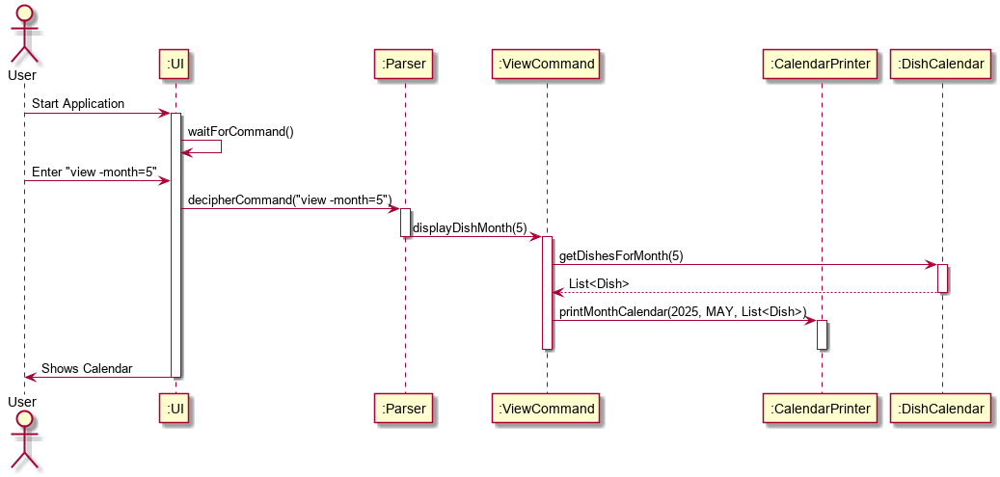
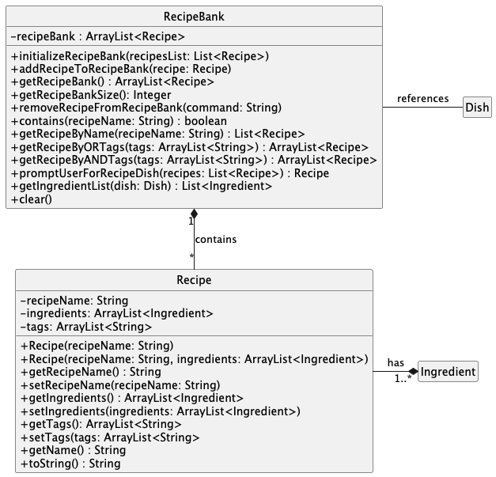
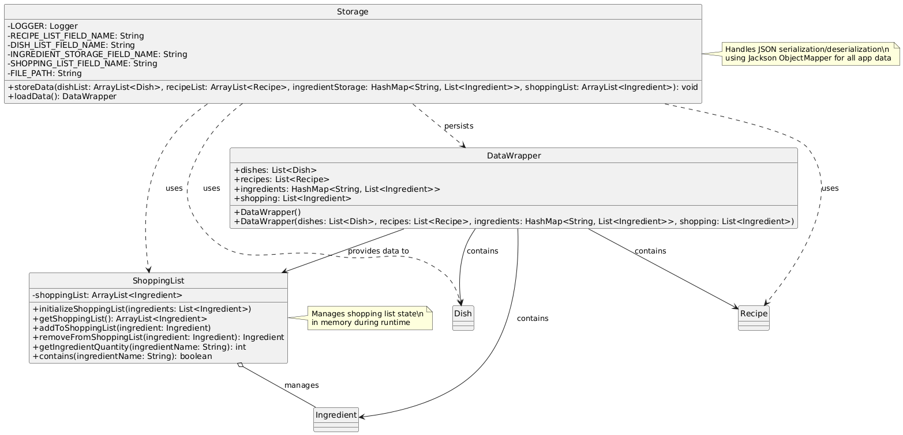
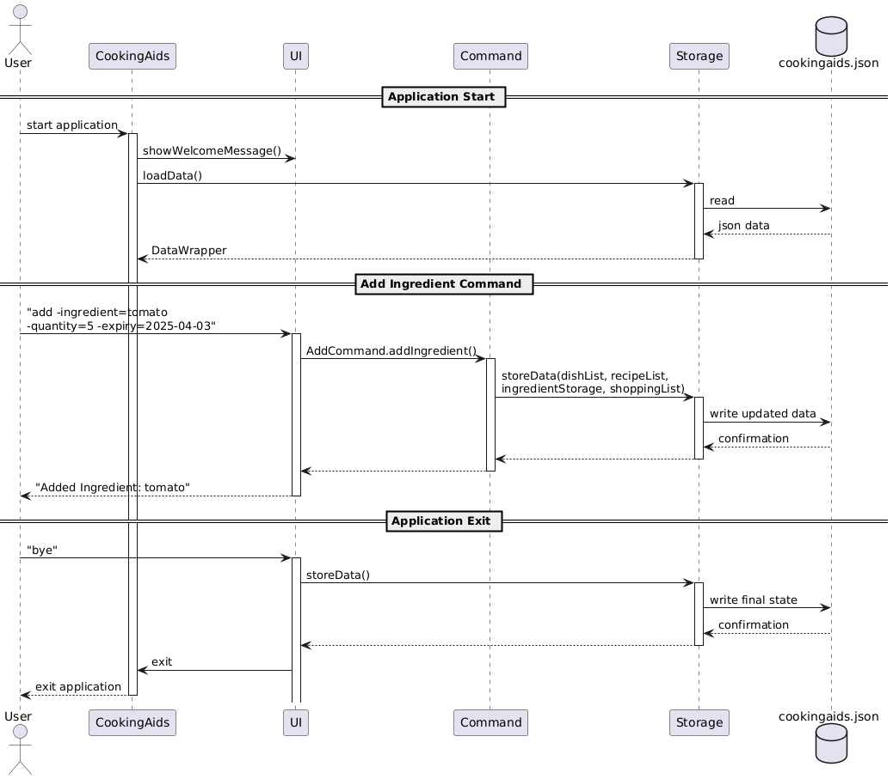
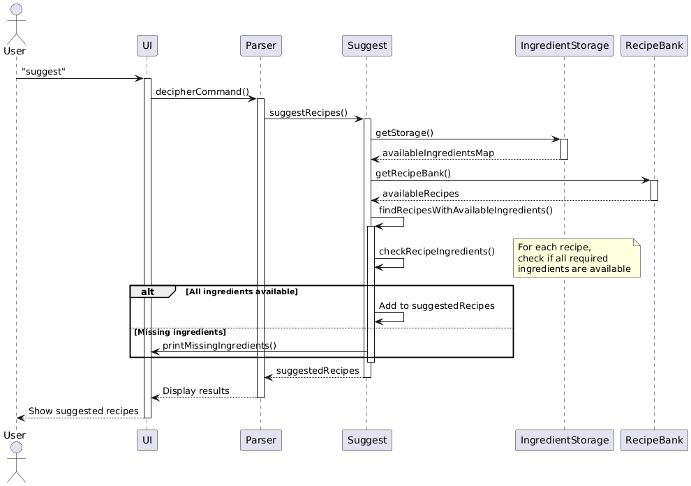

# Developer Guide

## Table of Contents
- [Acknowledgements](#acknowledgements)
- [Design & Implementation](#design--implementation)
  - [Main Components](#main-components-of-the-architecture)
  - [Architecture Interactions](#how-the-architecture-components-interact-with-each-other)
  - [UI Component](#ui)
  - [Collections Component](#collections)
  - [Items Component](#items)
  - [Commands Component](#commands)
  - [Parser Component](#parser)
  - [Storage Component](#storage)
- [Appendix: Requirements](#appendix-requirements)
  - [Product Scope](#product-scope)
  - [User Stories](#user-stories)
  - [Non-Functional Requirements](#non-functional-requirements)
  - [Instructions for Manual Testing](#instructions-for-manual-testing)

## Acknowledgements
<!-- -->


## Design & implementation

Given below is a quick overview of main components and how they interact with each other.

### Main components of the architecture

The class `CookingAids` is in charge of the app launch and shut down.

* At init, it initializes the other components in the correct sequence, and connects them up with each other.
* At shut down, it shuts down the other components and invokes cleanup methods where necessary.

The bulk of the app's work is done by the following components:

* `UI`: The UI of the App.
* `Command`: The command executor.
* `Collections`: Operates on data of the App in memory.
* `Storage`: Reads data from, and writes data to, the hard disk.
* `Items`: Represents a collection of classes used by other components.

<div style="page-break-after: always;"></div>

### How the architecture components interact with each other

The _Sequence Diagram_ below shows how the components interact with each other for the scenario where the user issues
the command: 
```
add -ingredient=tomato -quantity=5 -expiry=2025/04/03
```


<div style="page-break-after: always;"></div>

### UI

#### <ins>Overview</ins>

The UI package contains classes responsible for handling user interactions, displaying output, and printing formatted views for various components.

#### <ins>Implementation</ins>

Contains the following classes and their respective purposes:

* `Ui` manages the user interface, handles command input, and displays information to the user.
* `CalendarPrinter` prints a formatted monthly calendar view, displaying scheduled dishes.

These classes facilitate user interaction by providing formatted output and handling command-based operations.

Below is a Sequence Diagram of an example of how a User performs command view -month=5 to view his dishes for the month of May

The class diagrams of UI and Calendar printer are seen below

#### <ins>Design Considerations</ins>

We designed the UI package to provide clear and structured user interactions. Separating UI functions from logic ensures modularity, making it easier to maintain and update. The `Ui` class handles receiving commands and user interaction, while `CalendarPrinter` focuses on structured visual representation of scheduled dishes.

This approach keeps business logic separate from UI logic, improving code maintainability and readability.

<div style="page-break-after: always;"></div>

### Collections

#### <ins>Overview</ins>

The Collections component contains classes that perform operations requested by the User on their respective Items

#### <ins>Implementation</ins>

Contains the classes and their respective purposes:

* `DishCalendar` manages dishes assigned to a respective date
* `RecipeBank` manages list of recipes learnt
* `IngredientStorage` manages current inventory of ingredients
* `ShoppingList` manages ingredients needed to be purchased

These classes all contain temporary storage to hold the result after the operations.

#### <ins>Design Considerations</ins>

We used this design for easier modularity. There are many different items such as Dishes, Recipes, Ingredients
and they each have their unique purposes and attributes. Hence, we decided to create separate classes that will handle
operations on items separately and keep a temporary storage of the results of operations, before storing them in a JSON
file.

The following is a class diagram of one of the classes `IngredientStorage`.


<div style="page-break-after: always;"></div>

### Items

#### <ins>Overview</ins>

The Items component contains classes that represent the smallest unit of functionality for this project.

#### <ins>Implementation</ins>

* `Food` is an abstract class.
* `Ingredient` extends from Food and contains information related to ingredients (name, expiry)
* `Recipe` contains the information of one recipe (name, ingredients)
* `DishDate` represents the date of a `Dish`
* `ExpiryDate` extends from DishDate and represents the expiry date of ingredients
* `Dish` denotes when a `Recipe` is scheduled for a certain `DishDate`

<div style="page-break-after: always;"></div>

#### <ins>Design Considerations</ins>

The following is the class diagram for the classes `Recipe` and `RecipeBank`.



The Items classes follow the above design consideration of modularity. Each class in this package serves as building
blocks for the rest of the project.

<div style="page-break-after: always;"></div>

### Commands

#### <ins>Overview</ins>

The Commands component contains classes that execute specific actions on their respective Collections based on user input. These commands facilitate modifications, retrieval, and processing of data within the system. The command `suggest` is covered in its [own section](#suggest) for conciseness.

#### <ins>Implementation</ins>

Contains the classes and their respective purposes:

* `AddCommand` adds Dishes, Recipes and Ingredients to their respective collections.
* `ListCommand` lists scheduled Dishes, known Recipes and available Ingredients.
* `ViewCommand` displays Dish Calendar, or Shopping List of ingredients to purchase.
* `UpdateCommand` updates details of Recipes or Ingredients.
* `DeleteCommand` removes Dishes, Recipes and Ingredients from their respective collections.
* `HelpCommand` displays a manual for the commands and a link to the User Guide.
* `SuggestCommand` suggests possible Recipes to cook based on available Ingredients.
* `SearchCommand` searches Recipes based on tags.

Each command interacts with a specific collection and ensures the necessary updates are performed before storing changes in the system.

<div style="page-break-after: always;"></div>

#### <ins>Design Considerations</ins>

We used this design to maintain a clear separation of concerns. Commands act as intermediaries between user input and data manipulation, ensuring that modifications to collections are structured and easily extendable. This modular approach allows for easy addition of new commands in the future without interfering with existing functionality.

The following is a UML diagram of the `commands` package:


<div style="page-break-after: always;"></div>

### Parser

#### <ins>Overview</ins>

The Parser component is responsible for interpreting user input and executing the corresponding commands. It ensures that user instructions are correctly formatted and directs them to the appropriate operations.

#### <ins>Implementation</ins>

The `Parser` class contains methods to process and handle different user commands:

* `decipherCommand(String receivedText)`: Identifies the command type from user input and executes the relevant method.
* `handleViewCommand(String receivedText)`: Handles requests to view data based on user-specified parameters.
* `handleDisplayCommand(String receivedText)`: Manages the display of lists such as recipes, dishes and ingredients.
* `handleAddCommand(String receivedText)`: Directs the addition of new recipes, dishes, or ingredients to their respective collections.
* `handleDeleteCommand(String receivedText)`: Manages the removal of recipes, dishes, or ingredients based on user input.
* `parseDish(String input)`: Extracts dish name and scheduled date from user input.
* `parseRecipe(String receivedText)`: Extracts recipe details and its required ingredients.
* `parseIngredient(String command)`: Parses an ingredient command into a structured data format with ingredient name, expiry date and quantity.

The `Parser` class interacts with all command classes.

<div style="page-break-after: always;"></div>

#### <ins>Design Considerations</ins>

The design choice of the `Parser` class emphasizes modularity and maintainability. By having separate handler methods for different command types, the system can be easily extended with new commands while keeping parsing logic clear. This approach ensures:

1. **Separation of concerns**: Each command type is processed independently.
2. **Scalability**: New commands can be integrated without affecting existing logic.
3. **Error handling**: Unrecognized commands are identified, preventing incorrect execution.

The following is an overview of the `Parser` class and its interactions:


<div style="page-break-after: always;"></div>

### Storage

#### <ins>Overview</ins>

The Storage component is responsible for reading data from and writing data to the hard disk. It does this by serializing a `DataWrapper` class that contains all objects to be serialized with Jackson, a JSON serializing library. 

#### <ins>Implementation</ins>

* Handles persistence of application data using JSON format
* Manages file I/O operations for:
  - Recipes
  - Ingredients
  - Dishes
  - Scheduled dishes
  - Shopping lists

Below is a class diagram showing the interactions between the `Storage` and `DataWrapper` classes, with all other components:



The Storage class handles two main operations:
1. **Loading**. The loading of data is done only once, when the program is launched.
2. **Storing**. The storing of data occurs every time any of its fields are updated, which includes the adding and deleting of dishes, ingredients, and recipes. 
Below is a sequence diagram of how the main components interact with the Storage class throughout its lifecycle—startup, data modification, and exit.

#### <ins>Design Considerations</ins>

The Storage component uses JSON format for data persistence. This is for a few reasons:
- Human-readable format makes debugging easier
- Built-in support via Jackson ObjectMapper
- Flexible schema allows for future extensions

<div style="page-break-after: always;"></div>

### Suggest
#### <ins>Overview</ins>
The Suggest component helps users discover recipes they can make with currently available ingredients. 
#### <ins>Implementation</ins>
The `Suggest` class contains a method that obtains the suggestions, and a few other helper methods:


* `suggestRecipes()`: Main method that returns a list of recipes that can be made with available ingredients
* `getAvailableIngredientNames()`: Gets all ingredient names from storage (case-insensitive)
* `findRecipesWithAvailableIngredients()`: Matches available ingredients against recipe requirements
* `checkRecipeIngredients()`: Validates if a specific recipe can be made with available ingredients
* `printMissingIngredients()`: Shows which ingredients are missing for recipes that can't be made

Below is a sequence diagram detailing the control flow:


#### <ins>Design Considerations</ins>
1. **Case Insensitivity**: Ingredient matching is case-insensitive to improve user experience
2. **Helpful Feedback**: When recipes can't be made, the system shows which ingredients are missing
3. **Separation of Concerns**: The suggestion logic is separated from ingredient storage and recipe management

The component follows SOLID principles: 
- Single Responsibility: Focuses solely on recipe suggestions
- Open for Extension: New suggestion algorithms can be added 
- Depends on abstractions: Works with ingredient and recipe interfaces


# Appendix: Requirements

## Product scope

### Target user profile

Students who have to cook meals on a tight budget and have limited free time.

### Value proposition

Our app, _COOKING AIDS_ helps students who are studying abroad who have to live on a tight budget plan and prepare
their meals effectively. The value our app brings to such students are that they no longer have to spend time and effort
planning their meals with their limited budget and time.

<div style="page-break-after: always;"></div>

## User Stories


| Version | As a ...                          | I can ...                                                       | So that I can ...                                                                  |
| ------- | --------------------------------- | --------------------------------------------------------------- | ---------------------------------------------------------------------------------- |
| v1.0    | Veteran cook                      | add new recipes to the list                                     | enjoy my own recipes without relying on the default list                           |
| v1.0    | forgetful student                 | see my current quantity of ingredients                          | check if I have enough ingredients to make foods and whether I should buy more     |
| v1.0    | indecisive user                   | change my meal plans                                            | have flexibility in my meals                                                       |
| v1.0    | forgetful student                 | see my meal plans for the day                                   | be reminded of what I planned to eat                                               |
| v1.0    | student on exchange               | plan my meals                                                   | efficiently plan out my use of ingredients                                         |
| v1.0    | someone new to cooking            | enter my current ingredients                                    | get suggestions on recipes                                                         |
| v1.0    | user who made a mistake           | delete entries                                                  | customize plan                                                                     |
| v2.0    | inexperienced cook                | see possible recipes that I can create with current ingredients | decide on what food I can create without the effort of referencing online material |
| v2.0    | user                              | see my shopping list                                            | save time and effort of thinking of what to buy for my meal plan                   |
| v2.0    | inexperienced cook                | see the difficulty and time it takes to cook a certain recipe   | know whether I have the time and skills to do some meals                           |
| v2.0    | forgetful student                 | keep track of expiry dates of foods                             | efficiently consume the foods without waste, and so I won't eat expired foods      |
| v2.0    | someone with dietary restrictions | filter recipes based on my restrictions                         | access meals I can eat                                                             |
| v2.0    | nutritionist                      | create healthy recipes for students                             | promote healthier diets amongst unhealthy youths                                   |
| v2.0    | student on a diet                 | home-cook food and be intentional with my ingredients           | maintain a balanced diet                                                           |
| v2.0    | a family member                   | figure out what to cook for the family                          | prepare a good dinner for loved ones                                               |
| v2.0    | student cook with roommates       | share shopping lists with my roommates                          | coordinate buying ingredients                                                      |
| v2.0    | student cook with friends         | calculate cost per meal of each person                          | easily split costs with friends                                                    |
| v2.1    | inexperienced cook                | click on links that direct me to youtube videos                 | refer to videos if I am unable to follow the recipe                                |
| v2.1    | poor student                      | find affordable food shopping locations near me                 | save money                                                                         |
| v2.1    | a busy cook                       | get reminders on expiry dates of ingredients                    | use all my groceries without wasting any                                           |
| v2.1    | beginner meal prepper             | see meal-prepping tips                                          | improve my meal-prepping                                                           |
| v2.1    | health conscious student          | track calories of dishes                                        | know exactly how many calories my food has                                         |
| v2.1    | aspiring chef                     | save my favourite recipes                                       | access them easily                                                                 |
| v2.1    | user that is going to shop soon   | be recommended recipes that are an item away                    | plan what to buy next when I'm not limited by my current ingredients               |

## Non-Functional Requirements

* Runs on any Java 17-compatible environment.
* Uses standard Java libraries and Jackson ObjectMapper for JSON serialisation.
* Supports fast startup (<1 second).
* A user with above average typing speed should be able to accomplish most of the tasks faster using commands than using a mouse.

## Instructions for manual testing

### Basic Testing 
Here we provide some basic testing, and is meant to be a starting point for testers. For more comprehensive or exploratory testing, visit the [automation testing](#automation-testing) section.
### Test: Launching and Shutdown
1. Ensure you have Java 17 installed.
2. Run using:
  ```shell
  java -jar tp.jar
  ```
> Note that CookingAids does not support double clicking on the `.jar` file is not supported on all operating systems. For reliability, we recommend launching the application through a terminal. 


Shutdown and save data by typing `bye` in the terminal window. 

**Expected Output**: 
- After launching: A welcome message, showing CookingAids version number. 
- After sending `bye`: `Stored Dish List successfully in: ./data/cookingaids.json
`.
### Test: Showing Help
Follow the same instructions for launching according to [the launch and shutdown test](#test-launching-and-shutdown).\
Type `help` in the terminal window. 

**Expected Output**:  A comprehensive help message detailing the commands and their appropriate flags. 

### Test: Adding ingredients, recipes, dishes
#### Adding Ingredients
Add some sample ingredients:
```text
add -ingredient=garlic -quantity=5 -expiry=2025/12/03
```
**Expected Output**: `Added Ingredient: garlic (5pcs, Expiry: 2025/12/03, Expiring Soon: No, Expired: No)
`
```aiignore
add -ingredient=bread -quantity=2 -expiry=2025/12/03
```
**Expected Output**: `Added Ingredient: bread (2pcs, Expiry: 2025/12/03, Expiring Soon: No, Expired: No)
`
```aiignore
add -ingredient=tomato 
```
**Expected Output**: `Added Ingredient: tomato (1pcs, Expiry: None, Expiring Soon: No, Expired: No)
`

After ensuring ingredients are added successfully, we can proceed to adding dishes. 
#### Adding Recipes
```aiignore
add -recipe=garlic_bread -needs=garlic,1,bread,2
```
**Expected Output**: 
```aiignore
Added Recipe: garlic_bread
Ingredients: garlic (1), bread (2)
```
#### Adding Dishes 
```aiignore
add -dish=garlic_bread -when=tmr
```
**Expected Output** (as of performing this test on 2025/04/08: `Added Dish: garlic_bread, Scheduled for: 2025/04/08
`.

### Test:Viewing Dish Calendar 
Make sure that you have added some dishes. Given the [above example](#adding-dishes-), we can do 
`view -month=4` to see our garlic bread dish.

**Expected Output**: 


### Test: Suggest 
Say we only had one ingredient available:
`  garlic (10pcs, Expiry: 2025/12/03, Expiring Soon: No, Expired: No)`.
Add a recipe like `garlic_bread`:
```aiignore
add -recipe=garlic_bread -needs=garlic,1,bread,2
```

Performing the `suggest` command should give us the following:
**Expected Output**: `Not enough ingredients for garlic_bread! Here's what you're missing: 
2 bread`

Once we add 2 pieces of bread, we should be able to get a suggestion: 

`You have enough ingredients to make: 
1: garlic_bread`


### Test: Saving and Loading Data 
Add some sample items. You may try those given from the [above tests](#test-adding-ingredients-recipes-dishes). 

Test that the saving of data works either by performing `Ctrl+C` (`Command+C` on MacOS) or by typing `bye` in the
terminal window. Ensure that file data is stored in `./data/cookingaids.json`.

### Automation Testing
We have written some test cases for automation testing. Below are some steps to perform this test in IntelliJ IDEA. 
1. Ensure you have the JUnit plugin installed. We will be using this to conduct our unit testing. 
2. In IntelliJ, navigate to `src/test`. A snippet of the project structure is shown below:


3. Right click the "test" folder, and click on "Run all tests in tp.test", if successful, a window should appear detailing the results of the test:


