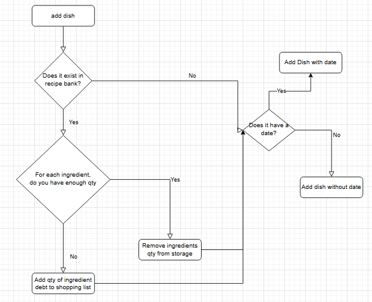
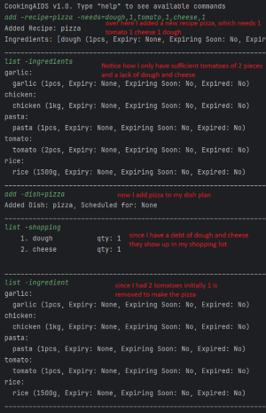
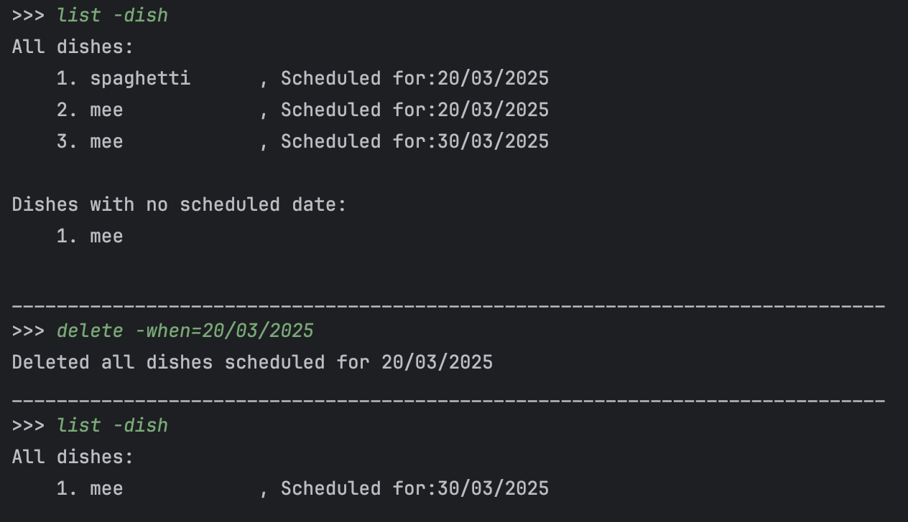

# **CookingAids User Guide**  

## **Table of Contents**  
- [Introduction](#introduction)
- [Notes About the Command Format](#notes-about-the-command-format)
- [Features](#features)
  1. [Viewing Help: `help`](#1-viewing-help-help)
  2. [Adding Dish to Schedule: `add -dish`](#2-adding-dish-to-schedule-add--dishdishname)
  3. [Adding an Ingredient: `add -ingredient`](#3-adding-an-ingredient-add--ingredientingredientname)  
  4. [Adding Recipe to Recipe Bank: `add -recipe`](#4-adding-recipe-to-recipe-bank-add--reciperecipename)
  5. [View Scheduled Dishes: `list -dish`](#5-view-scheduled-dishes-list--dish)  
  6. [View Available Ingredients: `list -ingredient`](#6-view-available-ingredients-list--ingredient)
  7. [View Available Recipes: `list -recipe`](#7-view-available-recipes-list--recipe)
  8. [View Shopping List: `view -shopping`](#8-view-shopping-list-view--shopping)
  9. [View Dishes for the Month: `view -month=`](#9-view-dishes-for-the-month-view--month1-12blank--year2015-2035)
  10. [Update Recipes: `update -recipe`](#10-update-recipes-update--recipe)
  11. [Update Dish: `update -dish`](#11-update-dish-update--dish)
  12. [Update Ingredient: `update -ingredient`](#12-update-ingredient-update--ingredient)
  13. [Delete Dish from Schedule: `delete -dish`](#13-delete-dish-from-schedule-delete--dishdishname)
  14. [Delete Ingredient: `delete -ingredient`](#14-delete-ingredient-delete--ingredientingredientname)
  15. [Delete Recipe from Recipe Bank: `delete -recipe`](#15-delete-recipe-from-recipe-bank-delete--reciperecipename)
  16. [Suggest Dishes: `suggest`](#16-suggest-dishes-suggest)
  17. [Search Recipes by Tag: `search -recipetags`](#17-search-recipes-by-tag-search--recipetags)
  18. [Exit program: `bye`](#18-exit-bye)
- [Command List](#command-list)

---

<div style="page-break-after: always;"></div>


## **Introduction**  

CookingAids is an app designed to help busy students living overseas on a budget save time and effort when planning and cooking meals.  
With CookingAids, you can:  
- Input your current ingredients.  
- Schedule dishes from a list of recipes.  
- View full recipes and cooking methods.  
- Track remaining ingredients and scheduled dishes.  

---

## **Notes About the Command Format**  

> **Command Format Notes:**  
> - Items in square brackets are optional.  
>   - Example: `add -dish={dishName} [-when{date}]` can be used as `add -dish={dishName}`.
> - Extraneous parameters for commands that do not take parameters (e.g., `help`) will be ignored.  
>   - Example: `help 123` will be interpreted as `help`.  
> - Recipes, dishes and ingredients should be named in snake case (ie lowercase words with underscores)
>   - Example: `chicken_rice` instead of `ChickenRice`

---

<div style="page-break-after: always;"></div>

## **Features**  

### **1. Viewing Help: `help`** 

Displays a link to this guide. 

**Usage:**  
```plaintext
help
```

**Expected Output:**  


---

### **2. Adding Dish to Schedule: `add -dish={dishName}`** 

Adds a dish to the calendar.
<br> if the dish name matches a recipe exactly, 
it will check if you have enough ingredients from the ingredients list and subtract accordingly.
<br> Any ingredient debts will be added to the shopping list.
<br> here is a rough flowchart of what goes on when adding dish


> **Warning:** __add dishes in lower_snake_case form__
> <br> If your dish contains multiple strings it will add the first string only

**Usage:**  
```plaintext
add -dish={dishName}  
add -dish={dishName} [-when={date}]
```

<br> Please add date in YYYY/MM/DD format only dates starting from today will be accepted

**Example:**
```plaintext
add -dish=pizza
add -dish=tomato_pasta -when=2025/05/01
add -dish=fries -when=tmr  //(tomorrow,today,td,tdy also works)
```

**Expected Output:**  

- `add -dish={dishName}`:  
  ```plaintext
  Added Dish: {dishName}, No scheduled date yet
  ```
- `add -dish={dishName} -when={date}`:  
  ```plaintext
  Added Dish: {dishName}, Scheduled for: {date}
  ```
- `add -dish={dishName} -when={unrecognised date}`:
  ```plaintext
  Could not recognise date! Saving without date
  Added Dish: {dishName}, No scheduled date yet
  ```

---
<div style="page-break-after: always;"></div>

### **3. Adding an Ingredient: `add -ingredient={ingredientName}`** 

Adds an ingredient to the ingredient database. Ingredients will be displayed with in-built units, the default is pcs.
<br> If no quantity is specified, it defaults to 1.
<br> If no expiry date is specified, it defaults to None.
<br> Please add date in YYYY/MM/DD format only future dates will be accepted
<br> _add ingredients in lower_snake_case form_ 

> **Warning:** Ingredients will not expire if no expiry date is set.  

**Usage:**  
```plaintext
add -ingredient={ingredientName} [-expiry={expiryDate}] [-qty={quantity}]
```

**Expected Output:**  

- **Without quantity or expiry:**
  `add -ingredient={ingredientName}`:
  ```plaintext
  Added Ingredient: {ingredientName} (1, Expiry: None, Expiring Soon: No, Expired: No)
  ```
- **With quantity:**
  `add -ingredient={ingredientName} -quantity={quantity}`:
  ```plaintext
  Added Ingredient: {ingredientName} ({quantity}, Expiry: None, Expiring Soon: No, Expired: No)
  ```
- **With expiry date:**
  `add -ingredient={ingredientName} -expiry={expiryDate}`:
  ```plaintext
  Added Ingredient: {ingredientName} (1, Expiry: {expiryDate}, Expiring Soon: Yes/No, Expired: Yes/No)
  ```
- **With quantity and expiry date:**
  `add -ingredient={ingredientName} -quantity={quantity} -expiry={expiryDate}`:
  ```plaintext
  Added Ingredient: {ingredientName} ({quantity}, Expiry: {expiryDate}, Expiring Soon: Yes/No, Expired: Yes/No)
  ```
  
---
<div style="page-break-after: always;"></div>

### **4. Adding Recipe to Recipe Bank: `add -recipe={recipeName}`**

Adds a new recipe to the recipe bank.
<br> _add recipes in lower_snake_case form_

**Usage:**
```plaintext
add -recipe={recipeName} -needs={ingredient_1},{quantity_1},{ingredient_2},{quantity_2}
```

**Expected Output:**

- `add -recipe={recipeName} -needs={ingredient1},{quantity_1},{ingredient2},{quantity_2}`:
  ```plaintext
  Added Recipe: {recipeName} 
  Ingredients: ingredient_1 (quantity_1), ingredient_2 (quantity_2)
  ```

---

### **5. View Scheduled Dishes: `list -dish`**

Displays a list of all dishes in dishList sorted by date
<br> add a -upcoming flag to view upcoming dishes filtered by date


**Usage:**  
```plaintext
list -dish  
list -dish -upcoming
```

**Expected Output:**  
- `list -dish`:  
  ```plaintext
  All dishes:  
  1. {dishName1} Scheduled for {date1}  
  2. {dishName2} Scheduled for {date2}
  3. {dishName2} Scheduled for {date3}
  
  Dishes with no scheduled date:
  1. {dishName3}   
  2. {dishName4} 
  3. {dishName5}   
  ```
- `list -dish -upcoming`:
  ```plaintext
  Todays dishes:
  1. {dishName1} Scheduled for {date1}  
  2. {dishName2} Scheduled for {date2}
  3. {dishName2} Scheduled for {date3}
  
  Upcoming dishes:
  1. {dishName1} Scheduled for {date1}  
  2. {dishName2} Scheduled for {date2}
  3. {dishName2} Scheduled for {date3}
  ```

---
<div style="page-break-after: always;"></div>

### **6. View Available Ingredients: `list -ingredient`**

Displays a list of available ingredients and their expiry dates.
<br> If too many ingredients are added, the maximum number will be displayed while still recognising the attempt to add


**Usage:**  
```plaintext
list -ingredient
```

**Expected Output:**  
- `list -ingredient`:
  ```plaintext
  {ingredientName1}
    List of ingredients with {ingredientName1} and different expiry dates
  {ingredientName2}
    List of ingredients with {ingredientName2} and different expiry dates  
  {ingredientName3}
    List of ingredients with {ingredientName3} and different expiry dates
  ```

---
### **7. View Available Recipes: `list -recipe`**

Displays a list of available recipes and/or their required ingredients.

**Usage:**
```plaintext
list -recipe  
```
**Expected Output:**
- `list -recipe`:
  ```plaintext
  Recipes:  
  - recipeName1  
  - recipeName2  
  - ...
  ```
---

### **8. View Shopping List: `view -shopping`**

Displays Shopping List with ingredients needed to cook dishes.
<br> shopping list is generated by adding dishes which generate an ingredient debt
<br> [see add dish to view flowchart](#2-adding-dish-to-schedule-add--dishdishname-)
<br> here is an image with annotations on how to use shopping list
<br>
<br> 

**Usage:**
```plaintext
view -shopping
```

**Expected Output:**
- `view -shopping`:
  ```plaintext
  1  {ingredientName1}  , qty {qty}
  2  {ingredientName2}  , qty {qty}
  3  {ingredientName3}  , qty {qty}
  ```

---

<div style="page-break-after: always;"></div>

### **9. View Dishes for the Month: `view -month={1-12/BLANK} [-year={2015-2035}]`**

Displays dishes scheduled for a specific month or the current month.
<br> Current date will be highlighted in red
<br> cells are 9 characters long, dishes with long names will be cut to fit cells

**Usage:**
```plaintext
view -month=1       //January  
view -month=11      //November  
view -month=        //Current month 
view -month=1 -year=2026
```

**Expected Output:**
- `view -month=`:


---

<div style="page-break-after: always;"></div>

### **10. Update Recipes: `update -recipe`**

Updates the name of a recipe and/or the required ingredients.

**Usage:**
```plaintext
update -recipe={recipeName} -newname={newName}
update -recipe={recipeName} -newingredients={new_ingredient_1,quantity_1,new_ingredient_2,quantity_2}
update -recipe={recipeName} -newname={newName} -newingredients={new_ingredient_1,quantity_1,new_ingredient_2,quantity_2}
update -recipe={recipeName} -newtags={tag1,tag2}
```

**Expected Output:**
- `update -recipe={recipeName} -newname={newName}`:
  ```plaintext
  Recipe name updated to: {newName}
  ```
- `update -recipe={recipeName} -newingredients={new_ingredient_1,quantity_1,new_ingredient_2,quantity_2}`:
  ```plaintext
  "Recipe ingredients updated successfully!"
  ```
- `update -recipe={recipeName} -newtags={tag1,tag2}`:
  ```plaintext
  "Recipe tags updated successfully!"
  ```

---
### **11. Update Dish: `update -dish`**

Updates the name of a recipe and/or the required ingredients.

<br> Please add date in YYYY/MM/DD format only dates starting from today will be accepted

**Usage:**
```plaintext
update -dish={dishName}

```

**Expected Output:**
- If multiple dishes are scheduled:
  ```plaintext
  Multiple dishes found:
  1, Date: {date1} - {dishName}
  2, Date: {date2} - {dishName}
  
  Which would dish would you like to reschedule? Input a number.
  
  Type New date in YYYY/MM/DD format.
  
  Change successful 
  {dishName}      , Scheduled for:{newDate}
  ```
- If only one dish is scheduled:
  ```plaintext
   Type New date in YYYY/MM/DD format.
  
  Change successful 
  {dishName}      , Scheduled for:{newDate}
  ```
- If dish is not found:
  ```plaintext
  No scheduled dishes found for: {dishName}
  ```
- If invalid input:
  ```plaintext
  Format error ensure you do not have additional flags. use update -dish={dishName} only, remove additional flags
  ensure that date is in YYYY/MM/DD format
  ```

---

### **12. Update Ingredient: `update -ingredient`**

Updates quantity and/or expiry date of an Ingredient in storage
<br> To update an ingredient, enter its name and current expiry date. If there is no expiry date you can leave it empty

<br> Please add date in YYYY/MM/DD format only dates starting from today will be accepted

**Usage:**
```plaintext
update -ingredient={ingredientName} [-expiry={expiryDate}] [-qty={quantity}] [-new_expiry={newExpiryDate]
```

**Expected Output:**
- If ingredient to be updated cannot be found:
  ```plaintext
  Ingredient not found: {ingredientName}
  ```
- If update is successful:
  ```plaintext
  Ingredient updated successfully
  ```
- If invalid input:
  ```plaintext
  Invalid format. Use: update -ingredient=ingredient_name -expiry=YYYY/MM/DD -quantity=quantity, 
  the only dashes should be for the flags
  ```
---

### **13. Delete Dish from Schedule: `delete -dish={dishName}`** 

Removes a dish from the schedule.  

> **Warning:** deleting dishes causes ingredients used up by them to be released back into ingredient storage with no expiry date
> <br> we only assume you use the ingredients that are expiring soon we have no way of knowing which ingredients 
> you actually plan use, please use [update -ingredient](#12-update-ingredient-update--ingredient) method to reset expiry date

**Usage:**  
```plaintext
delete -dish={dishName}  
delete -when={date}  
delete -dish={dishName} -when={date}
```

**Expected Output:**  
- If multiple dishes with the same name are scheduled:  
  ```plaintext
  Multiple dishes found:
  1, Date: {date1} - {dishName}
  2, Date: {date2} - {dishName}
  Which would you like to delete? Input a number.
  ```
  - Valid input:
    ```plaintext
    {date} - {dishName} Successfully deleted!
    ```
  - Invalid input:
    ```plaintext
    Invalid choice. No dish deleted.
    ```
- Bulk delete by when
  ```plaintext
  The application supports deletion of dishes on a single date.
  ```
  Example usage of `delete -when={date}`:
  
- If only one dish is scheduled:  
  ```plaintext
  {date} - {dishName} Successfully deleted!
  ```
- If dish is not found:
  ```plaintext
  No scheduled dishes found for: {dishName}
  ```


---

### **14. Delete Ingredient: `delete -ingredient={ingredientName}`** 

Removes an ingredient and all its quantities from the storage.

**Usage:**  
```plaintext
delete -ingredient={ingredientName}
```

**Expected Output:**  
- `delete -ingredient={ingredientName}`:
  ```plaintext
  Deleted {ingredientName} from the list of available ingredients.
  ```

---

### **15. Delete Recipe from Recipe Bank: `delete -recipe={recipeName}`** 

Deletes a recipe from the recipe bank.

**Usage:**  
```plaintext
delete -recipe={recipeName}
```

**Expected Output:**
- On successful deletion:
  ```plaintext
  {recipeName} has been deleted from the recipe bank!
  ```
- If multiple recipes with same name:
  ```plaintext
  Multiple recipes found:
  1, {recipeName}, Ingredients: {ingredient_list_1}
  2, {recipeName}, Ingredients: {ingredient_list_2}
  Which recipe would you like to delete? Input a number.
  ```
  
---

### **16. Suggest Dishes: `suggest`**

Suggests dishes based on available ingredients.

**Usage:**
```
suggest
``` 
**Expected Output:**
- `suggest`:
  ```plaintext
  You have enough ingredients to make: 
  1: carbonara
  2: garlic_bread
  ```
  
---

### **17. Search Recipes by Tag: `search -recipetags=`**

Search recipes by user-defined tag. 
Tags can be AND-based (results will have all recipes that match all tags) 
or OR-based (results will have all recipes that match at least one tag).
If no flag is given, the default is OR-based.

**Usage:**
```
search -recipetags=italian,mexican
search -recipetags=italian,mexican -type=or
``` 
**Expected Output:**
- `search -recipetags=italian,mexican`
```plaintext
Recipes that match your tags:
1: garlic_bread
2: tacos
```
- `search -recipetags=italian,mexican -type=or`
```plaintext
Recipes that match your tags:
1: garlic_bread
2: tacos
```
- `search -recipetags=italian,mexican -type=and`
```plaintext
No recipes match your tags.
```
---

### **18. Exit: `bye`**

Exits the program.

**Usage:**
```
bye
``` 
**Expected Output:**
- `bye`:
  ```plaintext
  Stored Dish List successfully in: ./data/cookingaids.json
  ```

---

<div style="page-break-after: always;"></div>

## **Command List**  

| **Action**  | **Format, Examples**                                                                                                                                                                                                       |  
|:------------|:---------------------------------------------------------------------------------------------------------------------------------------------------------------------------------------------------------------------------|  
| **Add**     | `add -ingredient`, `add -dish`, `add -recipe` <br> Example: `add -ingredient=tomato -expiry=today -quantity=2`, `add -dish=tomato_soup -when=tmr`, `add -recipe=tomato_soup -needs=tomato,5,onion,2`                       |  
| **View**    | `view -month`, `view -shopping` <br> Example:`view -month=2`, `view -month= -year=2026`, `view -shopping`                                                                                                                  |
| **Update**  | `update -recipe`,`update -dish` <br> Example:`update -recipe=toast -newname=sandwich -newingredients=bread,2,egg,1,ham,1 -newtags=lunch,to_try`                                                                            |
| **Delete**  | `delete -ingredient`, `delete -dish`, `delete -recipe` <br> Example: `delete -ingredient=tomato`, `delete -dish=tomato_soup`                                                                                               |  
| **Suggest** | `suggest`                                                                                                                                                                                                                  |
| **Search**  | `search -recipetags` <br> Example: `search -recipetags=italian`, `search -recipetags=italian,easy -type=and`, `search -recipetags=italian,mexican -type=or`                                                                |
| **Bye**     | `bye`                                                                                                                                                                                                                      |
