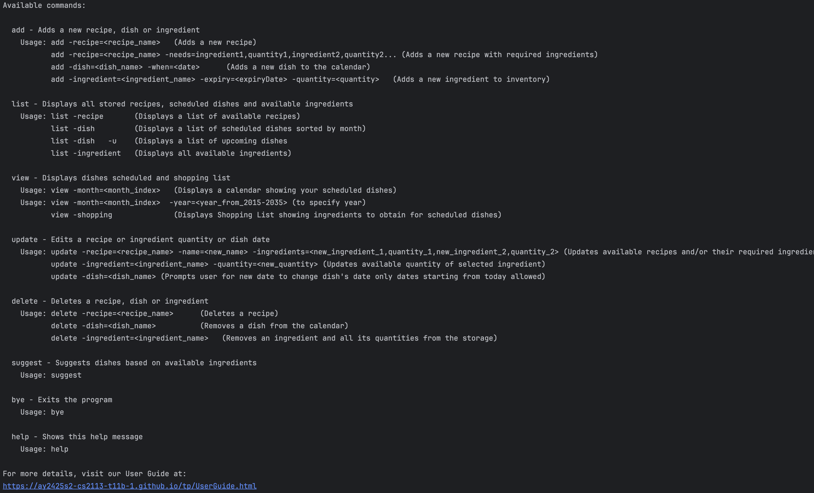
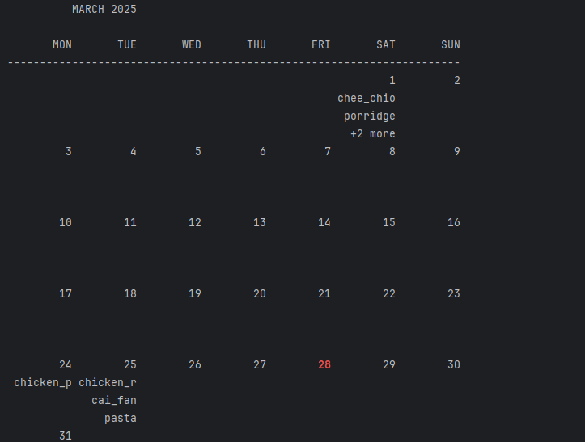

# **CookingAids User Guide**  

## **Table of Contents**  
- [Introduction](#introduction-)
- [Notes About the Command Format](#notes-about-the-command-format-)
- [Features](#features-)
  1. [Viewing Help: `help`](#1-viewing-help-help-)
  2. [Adding Dish to Schedule: `add -dish`](#2-adding-dish-to-schedule-add--dishdishname-)
  3. [Adding an Ingredient: `add -ingredient`](#3-adding-an-ingredient-add--ingredientingredientname-)  
  4. [Adding Recipe to Recipe Bank: `add -recipe`](#4-adding-recipe-to-recipe-bank-add--reciperecipename)
  5. [View Scheduled Dishes: `list -dish`](#5-view-scheduled-dishes-list--dish)  
  6. [View Available Ingredients: `list -ingredient`](#6-view-available-ingredients-list--ingredient) 
  7. [View Shopping List: `list -shopping`](#7-view-shopping-list-list--shopping)
  8. [View Dishes for the Month: `view -month=`](#8-view-dishes-for-the-month-view--month1-12blank)
  9. [View Available Recipes: `list -recipe`](#9-view-available-recipes-list--recipe)
  10. [Delete Dish from Schedule: `delete -dish`](#10-delete-dish-from-schedule-delete--dishdishname-)
  11. [Delete Ingredient: `delete -ingredient`](#11-delete-ingredient-delete--ingredientingredientname-)
  12. [Delete Recipe from Recipe Bank: `delete -recipe`](#12-delete-recipe-from-recipe-bank-delete--reciperecipeindex-)
  13. [Suggest Dishes: `suggest`](#13-suggest-dishes-suggest)
- [Command List](#command-list-)

---

<div style="page-break-after: always;"></div>


## **Introduction**  

CookingAids is an app designed to help busy students living overseas on a budget save time and effort when planning and cooking meals.  
With CookingAids, you can:  
- Input your current ingredients.  
- Schedule dishes from a list of recipes.  
- View full recipes and cooking methods.  
- Track remaining ingredients and scheduled dishes.  

---

## **Notes About the Command Format**  

> **Command Format Notes:**  
> - Items in square brackets are optional.  
>   - Example: `add -dish={dishName} [-when{date}]` can be used as `add -dish={dishName}`.  
> - Parameters can be in any order.  
>   - Example: `add -dish={dishName} -when{date}` is equivalent to `add -when{date} -dish={dishName}`.  
> - Extraneous parameters for commands that do not take parameters (e.g., `help`) will be ignored.  
>   - Example: `help 123` will be interpreted as `help`.  
> - Recipes, dishes and ingredients should be named in snake case (ie lowercase words with underscores)
>   - Example: `chicken_rice` instead of `ChickenRice`

---

<div style="page-break-after: always;"></div>

## **Features**  

### **1. Viewing Help: `help`** 

Displays a link to this guide. 

**Usage:**  
```plaintext
help
```

**Expected Output:**  \


---

### **2. Adding Dish to Schedule: `add -dish={dishName}`** 

Adds a dish to the calendar. If no date is specified, it defaults to today.
<br> _add dishes in lower_snake_case form_

**Usage:**  
```plaintext
add -dish={dishName}  
add -dish={dishName} [-when={date}]
```

**Expected Output:**  

- `add -dish={dishName}`:  
  ```plaintext
  {dishName} has been added to today’s cooking list!
  ```
- `add -dish={dishName} -when={date}`:  
  ```plaintext
  {dishName} has been added to your cooking list on {date}!
  ```

---
<div style="page-break-after: always;"></div>

### **3. Adding an Ingredient: `add -ingredient={ingredientName}`** 

Adds an ingredient to the ingredient database. If no quantity is specified, it defaults to 1. If no expiry date is 
specifed, it defaults to None. 
<br> _Expiry date format is to be in YYYY/MM/DD_
<br> _add ingredients in lower_snake_case form_ 

> **Warning:** Ingredients will not expire if no expiry date is set.  

**Usage:**  
```plaintext
add -ingredient={ingredientName} [-expiry={expiryDate}] [-qty={quantity}]
```

**Expected Output:**  

- **Without quantity or expiry:**
  `add -ingredient={ingredientName}`:
  ```plaintext
  Added Ingredient: {ingredientName} (1, Expiry: None, Expiring Soon: No, Expired: No)
  ```
- **With quantity:**
  `add -ingredient={ingredientName} -quantity={quantity}`:
  ```plaintext
  Added Ingredient: {ingredientName} ({quantity}, Expiry: None, Expiring Soon: No, Expired: No)
  ```
- **With expiry date:**
  `add -ingredient={ingredientName} -expiry={expiryDate}`:
  ```plaintext
  Added Ingredient: {ingredientName} (1, Expiry: {expiryDate}, Expiring Soon: Yes/No, Expired: Yes/No)
  ```
- **With quantity and expiry date:**
  `add -ingredient={ingredientName} -quantity={quantity} -expiry={expiryDate}`:
  ```plaintext
  Added Ingredient: {ingredientName} ({quantity}, Expiry: {expiryDate}, Expiring Soon: Yes/No, Expired: Yes/No)
  ```
  
---
<div style="page-break-after: always;"></div>

### **4. Adding Recipe to Recipe Bank: `add -recipe={recipeName}`**

Adds a new recipe to the recipe bank.
<br> _add recipes in lower_snake_case form_

**Usage:**
```plaintext
add -recipe={recipeName} -needs={ingredient1},{quantity_1},{ingredient2},{quantity_2}
```

**Expected Output:**

- `add -recipe={recipeName} -needs={ingredient1},{quantity_1},{ingredient2},{quantity_2}`:
  ```plaintext
  Added Recipe: {recipeName} 
  Ingredients: [ingredient_1 (quantity_1), ingredient_2 (quantity_2)]
  ```

---

### **5. View Scheduled Dishes: `list -dish`**

Displays a list of scheduled dishes.  

**Usage:**  
```plaintext
list -dish  
list -dish={dishName}
```

**Expected Output:**  
- `list -dish`:  
  ```plaintext
  All dishes:  
  1. {dishName1} Scheduled for {date1}  
  2. {dishName2} Scheduled for {date2}
  3. {dishName2} Scheduled for {date3}
  
  Unscheduled
  1. {dishName3}   
  2. {dishName4} 
  3. {dishName5}   
  ```

---
<div style="page-break-after: always;"></div>

### **6. View Available Ingredients: `list -ingredient`**

Displays a list of available ingredients and their expiry dates.  

**Usage:**  
```plaintext
list -ingredient
```

**Expected Output:**  
- `list -ingredient`:
  ```plaintext
  {ingredientName1}
    List of ingredients with {ingredientName1} and different expiry dates
  {ingredientName2}
    List of ingredients with {ingredientName2} and different expiry dates  
  {ingredientName3}
    List of ingredients with {ingredientName3} and different expiry dates
  ```

---

### **7. View Shopping List: `list -shopping`**

Displays Shopping List with ingredients needed to cook dishes.

**Usage:**
```plaintext
list -shopping
```

**Expected Output:**
- `list -shopping`:
  ```plaintext
  1 - {ingredientName1}  
  2 - {ingredientName2}  
  3 - {ingredientName3}
  ```

---

<div style="page-break-after: always;"></div>

### **8. View Dishes for the Month: `view -month={1-12/BLANK}`**

Displays dishes scheduled for a specific month or the current month.

**Usage:**
```plaintext
view -month=1  # January  
view -month=11 # November  
view -month=   # Current month
```

**Expected Output:**
- `view -month=`:



---

<div style="page-break-after: always;"></div>

### **9. View Available Recipes: `list -recipe`**

Displays a list of available recipes and/or their required ingredients.

**Usage:**
```plaintext
list -recipe  
list -recipe={recipeName}
```
**Expected Output:**
- `list -recipe`:
  ```plaintext
  Recipes:  
  - recipeName1  
  - recipeName2  
  - ...
  ```
- `list -recipe={recipeName}`:
  ```plaintext
  recipeName:  
  - ingredientName1  
  - ingredientName2  
  - ...
  ```
---
### **10. Delete Dish from Schedule: `delete -dish={dishName}`** 

Removes a dish from the schedule.  

**Usage:**  
```plaintext
delete -dish={dishName}  
delete -when={date}  
delete -dish={dishName} -when={date}
```

**Expected Output:**  
- If multiple dishes are scheduled:  
  ```plaintext
  Multiple dishes found:
  1, Date: {date1} - {dishName}
  2, Date: {date2} - {dishName}
  Which would you like to delete? Input a number.
  {date} - {dishName} Successfully deleted!
  ```
- If only one dish is scheduled:  
  ```plaintext
  {date} - {dishName} Successfully deleted!
  ```
- If dish is not found:
  ```plaintext
  No scheduled dishes found for: {dishName}
  ```
- If invalid input:
  ```plaintext
  Invalid input
  ```

---

### **11. Delete Ingredient: `delete -ingredient={ingredientName}`** 

Removes an ingredient and all its quantities from the storage.

**Usage:**  
```plaintext
delete -ingredient={ingredientName}
```

**Expected Output:**  
- `delete -ingredient={ingredientName}`:
  ```plaintext
  Deleted {ingredientName} from the list of available ingredients.
  ```

---

### **12. Delete Recipe from Recipe Bank: `delete -recipe={recipeIndex}`** 

Deletes a recipe from the recipe bank using its index number.

**Usage:**  
```plaintext
delete -recipe={recipeIndex}
```
> Note: {recipeIndex} refers to the recipe's position number in the recipe bank (1-based indexing)

**Expected Output:**
- On successful deletion:
  ```plaintext
  {recipeName} has been deleted from the recipe bank!
  ```
- If invalid index:
  ```plaintext
  Please provide a valid recipe index!
  ```

---

### **13. Suggest Dishes: `suggest`**
Suggests dishes based on available ingredients. 
**Usage:**
```
suggest
``` 
**Expected Output:**
- `suggest`:
  ```plaintext
  You have enough ingredients to make: 
  1: carbonara
  2: garlic_bread
  ```
<div style="page-break-after: always;"></div>

## **Command List**  

| **Action**  | **Format, Examples**                                                                                                                                                                                 |  
|:------------|:-----------------------------------------------------------------------------------------------------------------------------------------------------------------------------------------------------|  
| **Add**     | `add -ingredient`, `add -dish`, `add -recipe` <br> Example: `add -ingredient=tomato -expiry=today -quantity=2`, `add -dish=tomato_soup -when=tmr`, `add -recipe=tomato_soup -needs=tomato,5,onion,2` |  
| **Delete**  | `delete -ingredient`, `delete -dish`, `delete -recipe` <br> Example: `delete -ingredient=tomato`, `delete -dish=tomato soup`                                                                         |  
| **List**    | `list -ingredient`, `list -dish`, `list -recipe`,`list -shopping`, <br> Example: `list -ingredient`                                                                                                  |  
| **View**    | `view -month` <br> Example:`view -month=2`, `view -month=`                                                                                                                                           |
| **Suggest** | `suggest`                                                                                                                                        |
| **Help**    | `help`                                                                                                                                                                                               |


