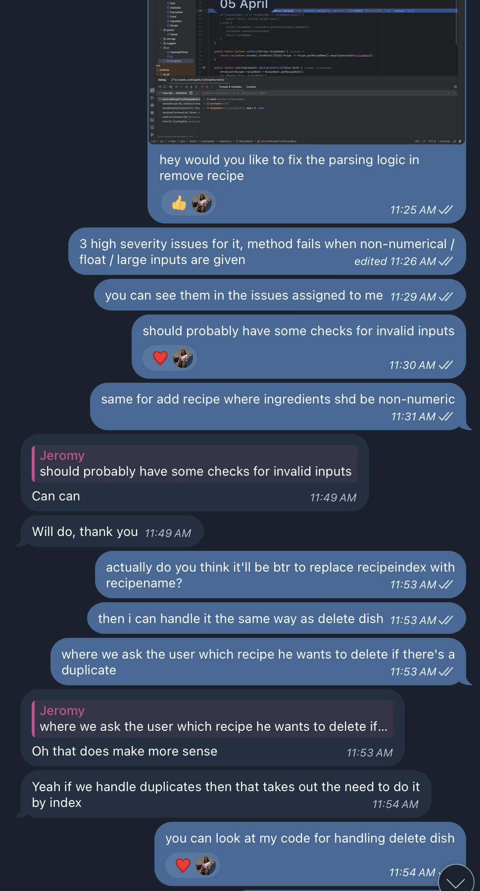
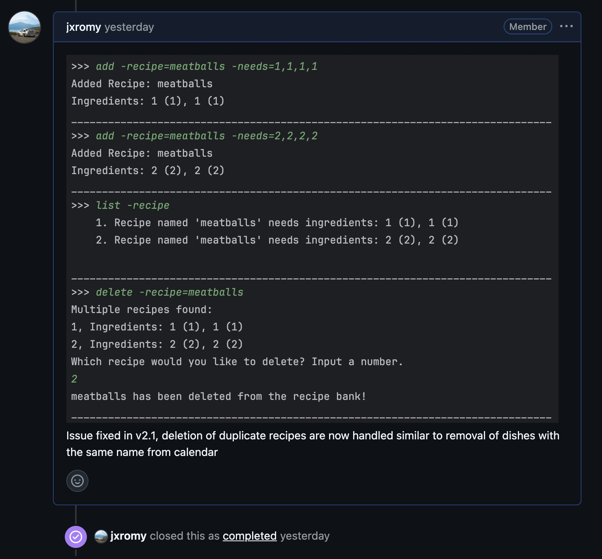
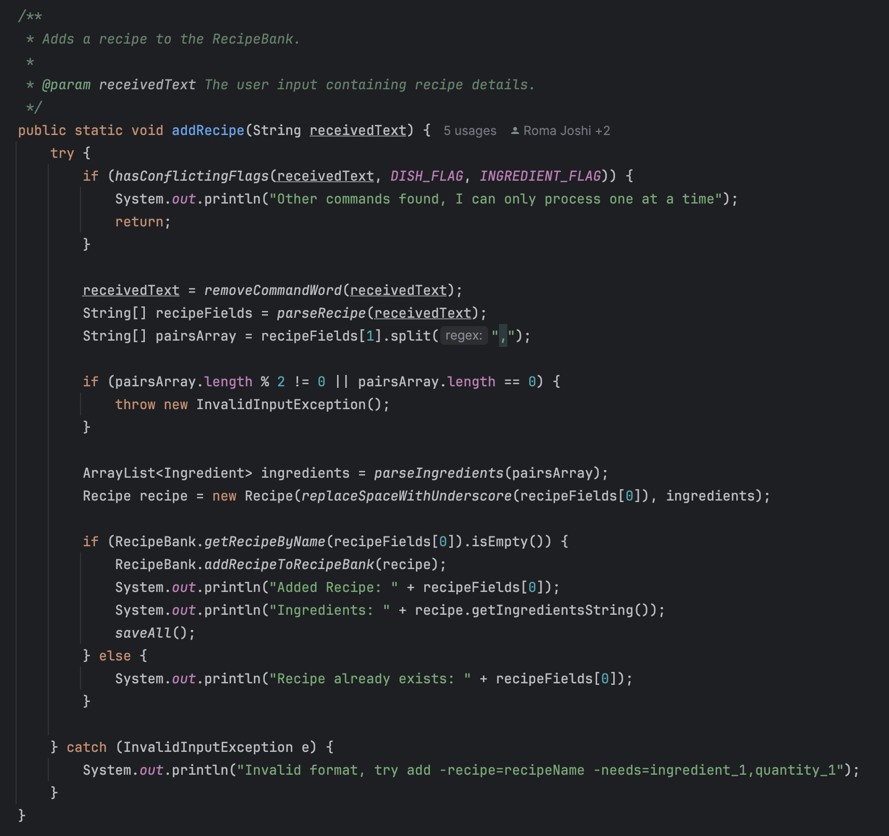
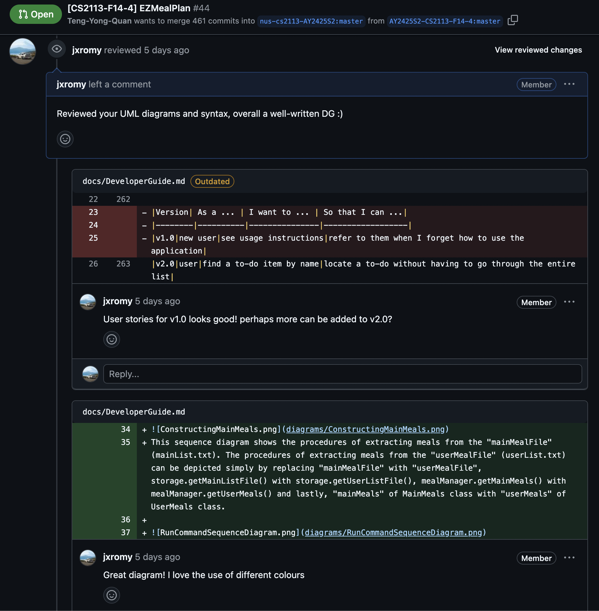
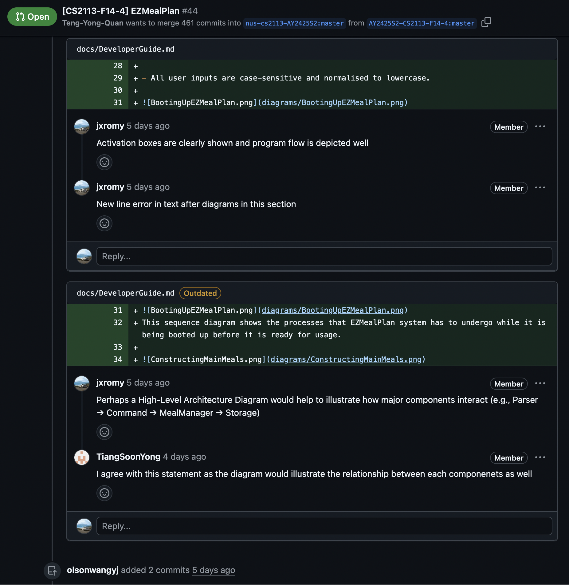

# Jeromy - Project Portfolio Page

## Overview

Cooking AIDS is a Command Line Interface (CLI) application that simplifies meal planning by allowing users to store, view, and organize their meals efficiently. It enables users to quickly retrieve recipes, add new ones, and schedule meals across a multiple years through intuitive commands in a terminal environment.

The application was built using Java and follows Object-Oriented Programming principles. It features a modular architecture that separates command parsing, user interface, data storage, and logic handling.

## **Summary of Contributions**

### **Code Contributed**
[View my code contributions on the tP Code Dashboard](<https://nus-cs2113-ay2425s2.github.io/tp-dashboard/?search=jxromy&sort=groupTitle&sortWithin=title&timeframe=commit&mergegroup=&groupSelect=groupByRepos&breakdown=true&checkedFileTypes=docs~functional-code~test-code~other&since=2025-02-21&tabOpen=true&tabType=authorship&tabAuthor=jxromy&tabRepo=AY2425S2-CS2113-T11b-1%2Ftp%5Bmaster%5D&authorshipIsMergeGroup=false&authorshipFileTypes=docs~functional-code~test-code~other&authorshipIsBinaryFileTypeChecked=false&authorshipIsIgnoredFilesChecked=false>)

### **Enhancements Implemented**

- **User Command Handling:**

I developed the logic for user commands, mainly:
    - `add` – allows users to add new recipes, ingredients, and dishes in multiple formats, storing essential information for each item.
    - `delete` – handles removal of recipes, ingredients and dishes by name, which includes logic to handle duplicate items for user to choose from.
    - `list` - displays a list of saved recipes, available ingredients and scheduled dishes
    - `help` – generates a help message to guide user and provides a link to user guide.

  Further assisted with the implementation of secondary commands `suggest`, `view`, `update` and `search`

The `add` and `delete` command classes were developed to recognise different command patterns and manipulate different item types, storing / removing them from their respective collections. All command class methods had to work seamlessly in the parser class, and I ensured that this was always true by fixing bugs whenever they arose. 

The command classes significantly contributes to the functionality of Cooking Aids as they are used to link user commands to the various collections.

- **Parsing Logic:**

I refined the central command parser that interprets user inputs and maps them to their corresponding actions. This involved:
- Refactoring early parsing implementations into a more modular and testable structure.
- Implementing a robust parsing structure to extract command keywords and arguments for the addition and deletion of recipes, ingredients or dishes.
- Handling edge cases such as missing flags, malformed inputs, and whitespace errors.

- **Wrote JUnit Tests:**

I developed comprehensive JUnit tests to ensure the correctness and robustness of core command functionalities and utility components in the Cooking Aids CLI application:

- **`CookingAidsTest`**  
  Verified the behavior of utility methods that assist with formatting outputs, parsing strings, and validating user inputs. These tests ensured edge case handling and robustness across different command inputs.

- **`AddCommandTest`**  
  Tested the logic for adding new recipes, ingredients, and dishes.
  - Validated correct parsing of arguments and proper updating of internal data structures.
  - Verified that appropriate error messages and guiding outputs are shown when invalid input is detected.

- **`DeleteCommandTest`**  
  Ensured the correct behavior when users attempt to delete recipes, ingredients, or dishes.
  - Included cases for detecting and resolving duplicate dish names, where users are prompted to confirm their intended selection.
  - Verified that appropriate error messages and guiding outputs are shown when invalid input is detected.

- **`HelpCommandTest`**  
  Validated the generation of our help message.
  - Ensured output content is accurate, consistent, and includes a link to our User Guide.

- **`ListCommandTest`**  
  Tested the listing functionality for various categories like dishes, ingredients, and recipes.
  - Confirmed that the output is well-formatted and dynamically reflects the current state of stored data.

- **`SuggestCommandTest`**  
  Verified the logic that suggests meals based on available ingredients and known recipes.
  - Covered edge case where no suggestions are available due to the lack of ingredients.

### **Contributions to the UG (User Guide)**

- Added detailed documentation for [features](https://github.com/AY2425S2-CS2113-T11b-1/tp/blob/master/docs/UserGuide.md#features) to guide users and ensure proper usage of Cooking Aids.
- Added example inputs and expected outputs for each command.
- Added a [Command List](https://github.com/AY2425S2-CS2113-T11b-1/tp/blob/master/docs/UserGuide.md#command-list) to summarise the available commands and provide example inputs in an easy to read table.

### **Contributions to the DG (Developer Guide)**

- Authored the [Parser](https://github.com/AY2425S2-CS2113-T11b-1/tp/blob/master/docs/DeveloperGuide.md#parser) and [Command](https://github.com/AY2425S2-CS2113-T11b-1/tp/blob/master/docs/DeveloperGuide.md#commands) implementation sections.
- Added UML diagrams:
    - **Class Diagram** to depict the Parser-Command relationship.
    - **Commands Sequence Diagram** illustrating the flow from user input to command execution.
- Documented the command execution lifecycle and detailed how input strings are tokenized and passed through the system.
- Explained our design considerations when implementing the command handler logic in Cooking Aids
- Validated the entire Developer Guide by helping teammates correct non-standard notations in their class diagrams.

### **Contributions to Team-Based Tasks**

- Participated actively in weekly team sync-ups and code walkthroughs.
- Wrote unit and integration test cases that validated command parsing logic.
- Coordinated with the rest of the team to ensure command logic aligned with the different collections' (Dish, Ingredient, Recipe) data structure.

### **Review / Mentoring Contributions**

- Reviewed issues and pull requests, offering suggestions to teammates to fix bugs spotted:
    - Brainstormed ideas to overcome challenges that teammates are facing in their implementation.

#### Discussion with Teammate:

#### Implementation:

  - Improved code modularity and adherence to CS2113 code quality guidelines by providing tips to teammates for following our course coding standards in their code and documentation.
  - Simplified conditional logic in command execution by refactoring nested `if` statements into guard clauses

  - Added inline documentation for public methods.

### **Contributions Beyond the Project Team**

- Reported 5+ bugs in other team's application during mock PE.
- Reviewed other team project and gave helpful suggestions for improvement.

#### Response from member of other group:

